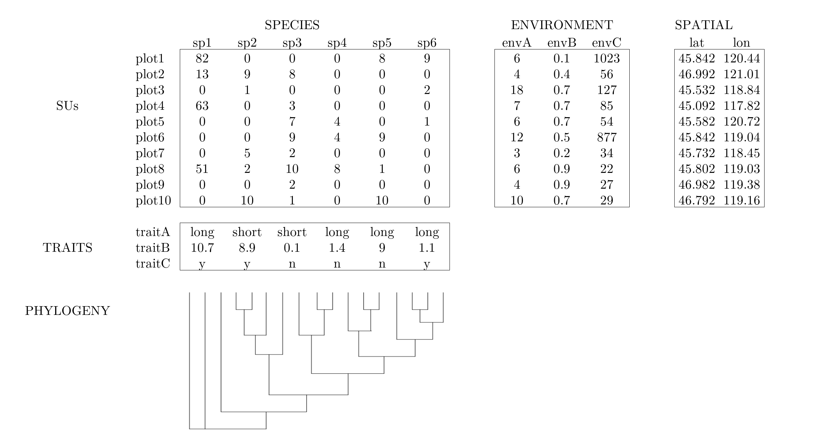

# Community Data

## General structure of community ecology data sets

Often times community ecology data is recorded in a set of tables that contain information on species presence/absence (or abundance) in plots, species trait values, environmental conditions of plots, and a phylogeny of the species.




## Today's example data set - Mafragh, Algeria vegetation data

We will use one core dataset throughout this tutorial. The `veg` dataset gives information about spatial coordinates, species, environment, traits, and phylogeny for plants on the Mafragh coastal plain in North Africa. 

Specifically, `veg` is a list containing five items:

- `xy`  97 observations of 2 spatial coordinates
- `spe` 97 observations of 56 plant species
- `env` 97 observations of 11 soil environmental variables
- `tra` 12 traits for 56 plant species
- `phy` phylogeny for 56 plant species


### Load the data

While we went over how to read in data via a \*.csv file in Section \@ref(intro-to-RStudio), we will take advantage of the fact that our example data sets have already been read in to R and saved as a \*.rda object.
The `veg.rda` object is a *list* object, with five elements. 
Each element is one of the data tables we will need for our analyses.

```{r load-data, eval=TRUE}
load('data/veg.rda')  # load the object (contains multiple objects)
xy  <- veg$xy           # spatial
spe <- veg$spe          # species
env <- veg$env          # environment
tra <- veg$tra          # traits
phy <- veg$phy          # phylogeny
rm(veg)                 # cleanup
ls()                    # list objects now in this local environment
```

***

#### Challenge 

Use the R functions and techniques covered in Section \@ref(intro-to-RStudio) to explore and examine the various data tables we just created from the `veg` object. What information do you think each data table contains?

***

## Study area description

The Mafragh plain is in El Tarf Province of far northeast Algeria (36.84704, 7.945). According to documentation in R package `ade4`:

> This marshy coastal plain is a geomorphological feature, east of Port of Annaba, limited to the north by the Mediterranean Sea and a dune cordon, to the south by clay-sandstone Numidian massifs, to the west by a wadi and to East by an irrigated perimeter. It covers 15,000 ha of which 10,000 form the area of study.

Potential human pressures include grazing, irrigation and salination, plowing, and housing development. Its Köppen climate type is "Csa: Hot-summer Mediterranean climate".

## History of the Mafragh dataset

The data originate from the field studies of Prof. Gérard de Bélair of Annaba in northeast Algeria. Born in France, de Bélair became a missionary priest in 1969 shortly after Algeria’s independence, then an agronomist during the Agrarian Revolution, then a botanist, then professor, then conservationist (according to his on account [https://www.visages-diocese-autun.fr/visage/de-belair-gerard/](https://www.visages-diocese-autun.fr/visage/de-belair-gerard/)). As of 2026, he continues to actively publish on the vegetation of northern Algeria.

We should recognize the colonialist legacies that brought us here. France controlled Algeria from 1830 until its independence in 1962. Prior to that, Algeria was occupied by Ottoman Turks, Spaniards, Arab Muslims, Berber/Amazigh, Romans, Phoenicians, and prehistoric occupants dating to at least 1.8 million years ago. We may speculate that the region’s vegetation and cultural histories have been closely intertwined.

The data were included in early versions of the ade4 software (Dray and Dufour 2007) which itself has its roots at Université Lyon 1, France. The present data are lightly modified from Appendix S4 of Pavoine et al. (2011), who also added a phylogeny.

## Key references

de Bélair, G. 1981. Biogéographie et aménagement de la Plaine de la Mafragh (Annaba - Algérie) [Biogeography and development of the Mafragh Plain (Annaba, Algeria)]. Dissertation, Université Paul Valéry, Montpellier. http://www.sudoc.fr/00871262X

de Bélair, G. 1990. Structure, fonctionnement et perspectives de gestion de quatre écocomplexes lacustres et marécageux (El Kala, Est-Algérien) [Structure, function and management perspectives of four lake and marsh eco-complexes (El Kala, East Algeria)]. Dissertation, Université des sciences et techniques de Montpellier 2. http://www.sudoc.fr/007729197

de Bélair, G. and M. Bencheikh-Lehocine. 1987. Composition et déterminisme de la végétation d’une plaine côtière marécageuse: La Mafragh (Annaba, Algérie) [Composition and determinism of the vegetation of a marshy coastal plain: La Mafragh (Annaba, Algeria)]. Bulletin d’Ecologie, 18(4): 393–407.

Dray, S. and A. Dufour. 2007. The ade4 package: implementing the duality diagram for ecologists. Journal of Statistical Software 22(4): 1-20. doi:10.18637/jss.v022.i04

Pavoine, S., Vela, E., Gachet, S., de Bélair, G. and Bonsall, M. B. 2011. Linking patterns in phylogeny, traits, abiotic variables and space: a novel approach to linking environmental filtering and plant community assembly. Journal of Ecology 99: 165–175. doi:10.1111/j.1365-2745.2010.01743.x
